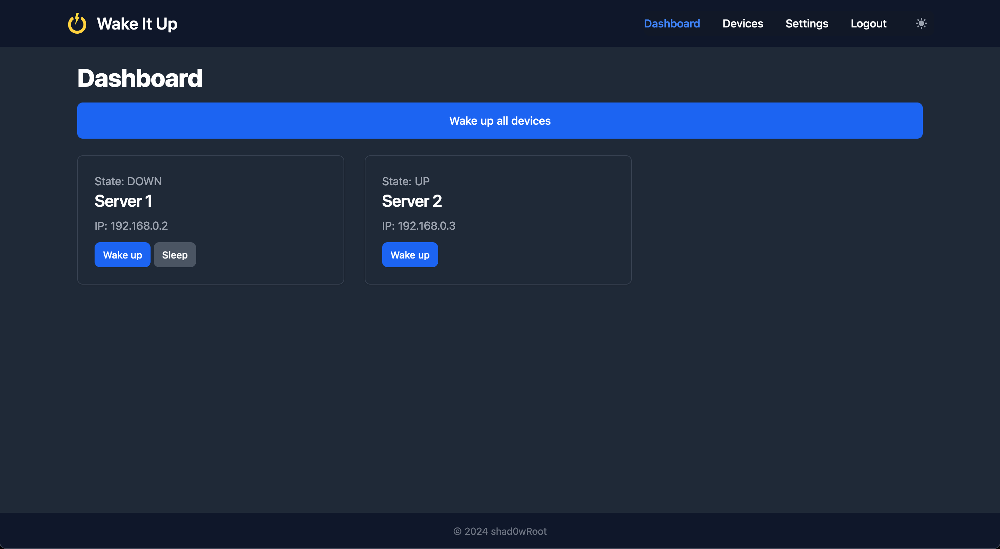
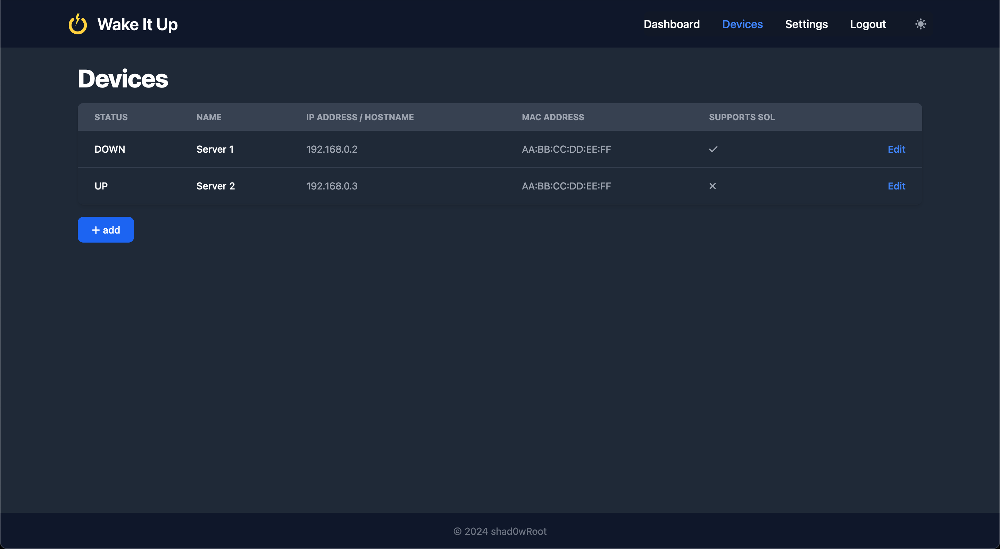
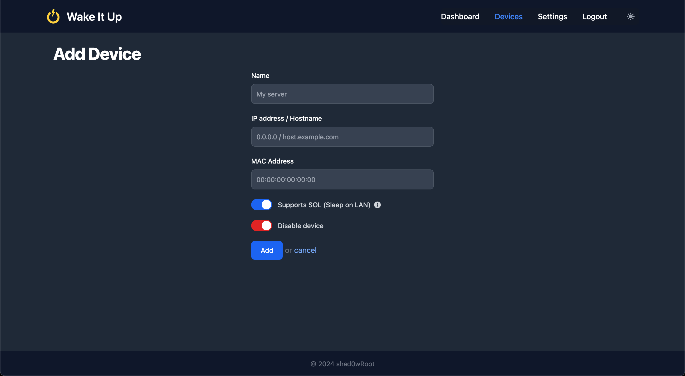

# Wake It Up

Wake It Up (WIU) is a web application for managing remote servers. It allows users to start servers, put them to sleep and ping them. Users are managed using OAuth2.

## Features

- Start servers using Wake On LAN
- Sleep servers using [Sleep On LAN](https://github.com/SR-G/sleep-on-lan)
- Ping servers to check their status
- User authentication and authorization using OAuth2
- Responsive web interface built with Tailwind and Flowbite
- MQTT support

## Screenshots





## Prerequisites

Before you begin the installation, ensure you have met the following requirements:

- Node.js (v14 or higher)
- npm (v6 or higher)
- Git
- An OAuth2 provider for user authentication
- MongoDB database
- Wake On LAN and Sleep On LAN compatible hardware

## Installation

1. Clone the repository:

     ```sh
     git clone https://github.com/shad0wRoot/wake-it-up.git
     ```

2. Navigate to the project directory:

    ```sh
    cd wake-it-up
    ```

3. Install dependencies:

    ```sh
    npm install
    ```

4. Start the application:

    ```sh
    npm start
    ```

5. Edit the config file located in
`wake-it-up/data/config.yml`

## Usage

1. Start the application:

    ```sh
    npm start
    ```

2. Open your browser and navigate to your configured base URL

## Changelog

### 1.1.0 (beta)

- Added option for MQTT waking up / putting devices to sleeping

## Contributing

1. Fork the repository
2. Create your feature branch:

    ```sh
    git checkout -b feature/your-feature-name
    ```

3. Commit your changes:

    ```sh
    git commit -m 'Add some feature'
    ```

4. Push to the branch:

    ```sh
    git push origin feature/your-feature-name
    ```

5. Open a pull request

## License

This project is licensed under the MIT License - see the [LICENSE](LICENSE) file for details.
